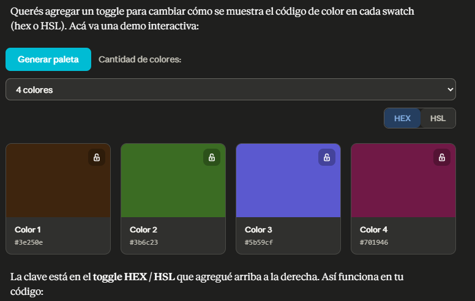
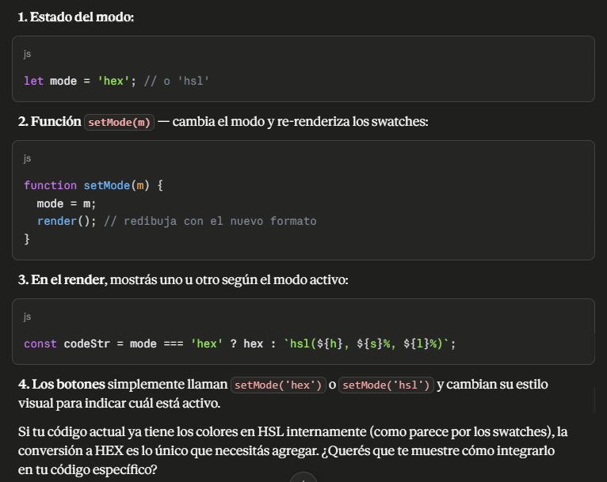
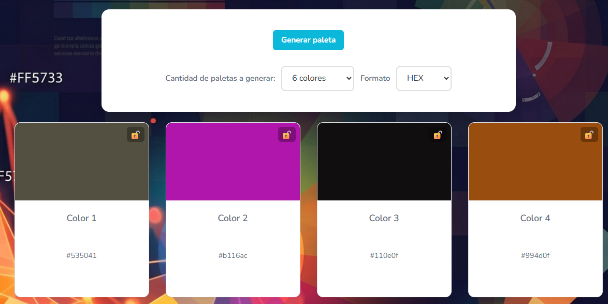

# HOLA 👋, SOY JOAQUIN SUAREZ

## ESTOY EN UN CURSO FULLSTACK 🔨

- 🌱 Estoy trabajando en un proyecto de SOYHENRY
- 🌿 Aprendiendo JS
- 🛡️ Busco ayuda para poder mejorar mis habilidades
- 💬 Preguntar por HTML y CSS
- 📧 Para contactarme [joaco.suaman@gmail.com](mailto:joaco.suaman@gmail.com)

**Connect with me:** joacosuare

**Languages and Tools:** css3 html5 javascript

# 🛒 ColorFly

ColorFly es una herramienta web interactiva diseñada para generar paletas de colores aleatorias con un solo clic.

## 🔗 Enlaces
- **Demo en vivo:  https://joaco2003.github.io/ProyectoM1__JoaquinSuarez/
- **Repositorio:  (https://github.com/joaco2003/ProyectoM1__JoaquinSuarez)

## 🚀 Funcionalidades Principales
*   **Generación instantánea:** Creación dinámica de nuevas paletas de colores aleatorias mediante una interacción simple (botón de generar).
*   **Identificación de colores:** Visualización clara de los códigos de color (Hex o hsl) directamente en pantalla, listos para ser utilizados.
*   **Copiado al portapapeles:** Permite al usuario hacer clic sobre el código de un color para copiarlo automáticamente, agilizando el flujo de trabajo.
*   **Bloqueo de colores:** Posibilidad de "congelar" uno o mas  colores específicos que le haya gustado al usuario mientras sigue generando aleatoriamente el resto de la paleta.
*   **Opción interactiva para cambiar la visualización de los códigos de color entre HEX y HSL.

## 🛠 Tecnologías Utilizadas
- **Frontend:** javascript, HTML5, CSS
- **Herramientas:** Git, GitHub.

## 🧠 Decisiones Técnicas
*  ** Manipulación del DOM: Utilice getElementById: por ejemplo en el botón de acción (generar) y el selector que define cuántos colores se van a mostrar (cantidad)
*  ** Renderizado dinámico: Una vez actualizados los datos, se ejecuta la función renderPaleta(), pasándole como argumento el valor actual del selector (convertido a número entero con parseInt).              Esto asegura que la vista siempre coincida con la cantidad de colores elegida por el usuario.
*  ** Diseño y UI: Se implementó una imagen de fondo (background-image) cuidadosamente seleccionada para mejorar la estética general.

# 🤖 Documentación del Uso de Inteligencia Artificial

Durante el desarrollo de este proyecto, se utilizó Inteligencia Artificial como herramienta de asistencia para optimizar tiempos.

## 🛠️ Herramientas Utilizadas
- **(Gemini / Claude )

## 📝 Casos de Uso y Prompts

### Caso 1: Bloqueador
**Objetivo:** Crear un bloqueador de colores.
**Prompt utilizado:**  "Yo hice una pagina de crear paletas de colores aleatorias, como es el codigo para que la paleta de color se bloquee"
**Resultado:**
La lógica de bloqueo de colores es bastante sencilla. La idea es guardar un estado por cada color indicando si está bloqueado, y al generar nuevos colores aleatorios, saltear los que están bloqueados. 
**Captura de pantalla:**

.png)

.png)
### Caso 2: HEX o HSL
**Objetivo:** [Ej: Crear un toggle eficiente para mostrar el codigo HSL o HEX.]
**Prompt utilizado:**
> "[Quiero agregar un toggle para cambiar cómo se muestra el código de color en cada swatch (HEX o HSL).]"
**Resultado:** [Opción interactiva para cambiar la visualización de los códigos de color entre Hexadecimal y HSL.]
**Captura de pantalla:**

