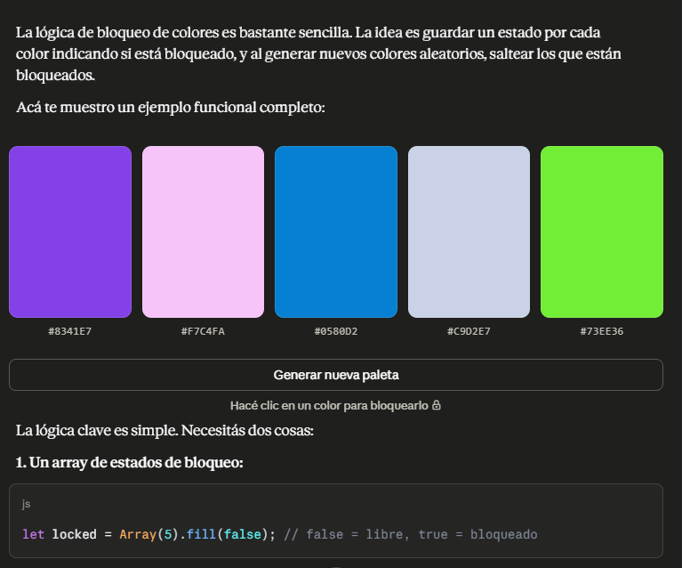

# 🤖 Documentación del Uso de Inteligencia Artificial

Durante el desarrollo de este proyecto, se utilizó Inteligencia Artificial como herramienta de asistencia para optimizar tiempos.

## 🛠️ Herramientas Utilizadas
- **(Gemini / Claude )

## 📝 Casos de Uso y Prompts

### Caso 1: Bloqueador
**Objetivo:** Crear un bloqueador de colores.
**Prompt utilizado:**
> "Yo hice una pagina de crear paletas de colores aleatorias, como es el codigo para que la paleta de color se bloquee"
**Resultado:**
La lógica de bloqueo de colores es bastante sencilla. La idea es guardar un estado por cada color indicando si está bloqueado, y al generar nuevos colores aleatorios, saltear los que están bloqueados. 
**Captura de pantalla:**

.png)

.png)
<!-- ----------------------------------------------------------------------- -->

### Caso 2: HEX o HSL
**Objetivo:** [Ej: Crear un toggle eficiente para mostrar el codigo HSL o HEX.]
**Prompt utilizado:**
> "[Quiero agregar un toggle para cambiar cómo se muestra el código de color en cada swatch (HEX o HSL).]"
**Resultado:** [Opción interactiva para cambiar la visualización de los códigos de color entre Hexadecimal y HSL.]
**Captura de pantalla:**

